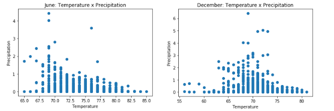

# Surfs_up
Tracking weather data for prospective surf shop.

## Overview
We analyze weather data collected over 7 years (1/2010 - 8/2017) to describe the climate at a prospective Surf n' Shakes shop location. Temperature data is reviewed and summary statistics are provided. This is later compared to precipitation to understand the combined effect of both out key data points.

## Results

*  June's middle 50% of temperatures ranges 4 degrees, 73 to 77. December's middle 50% of temperatures ranges 5 degrees, 69 to 74. Temperature is consistent and comfortable in these months.
*  December's lowest temperature, 56 degrees, is an extreme compared to June's 64 degree minimum.
*  Both months are not prone to extreme heat; both never exceed 90 degrees as the max temperature in over 1700 (June) and 1517 (December) observations.

## Analysis
Further, we take a look at precipitation as it compares to temperature in the following scatterplots:

This details when precipitation occurs within each month. Generally speaking, rainfall in June occurs during lower temperature days, whereas December rainfall occurs during moderate temperatures. Extreme levels of rainfall are infrequent, however there are many occurences of 0-1 inches of rainfall. Each precipitation plot's data is queried using the following:
'results_prcp_jun = []
results_prcp_dec = []
results_prcp_jun = session.query(Measurement.prcp).filter(extract('month', Measurement.date)==6).all()
results_prcp_dec = session.query(Measurement.prcp).filter(extract('month', Measurement.date)==12).all()'